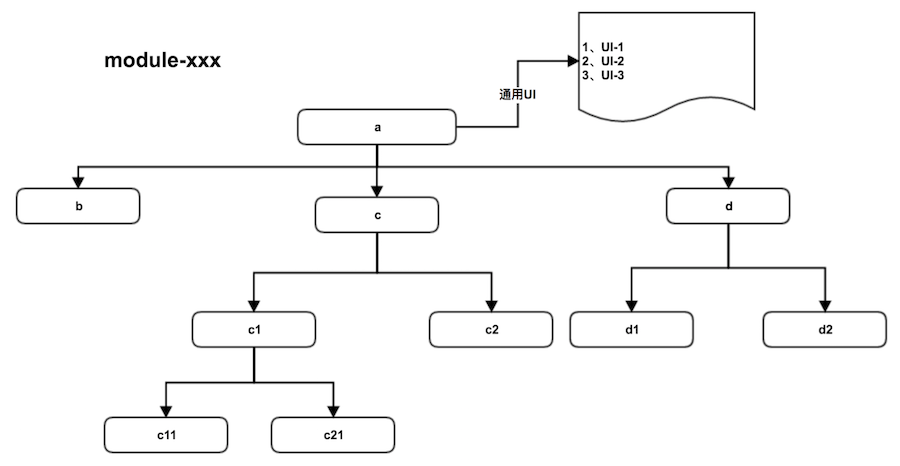
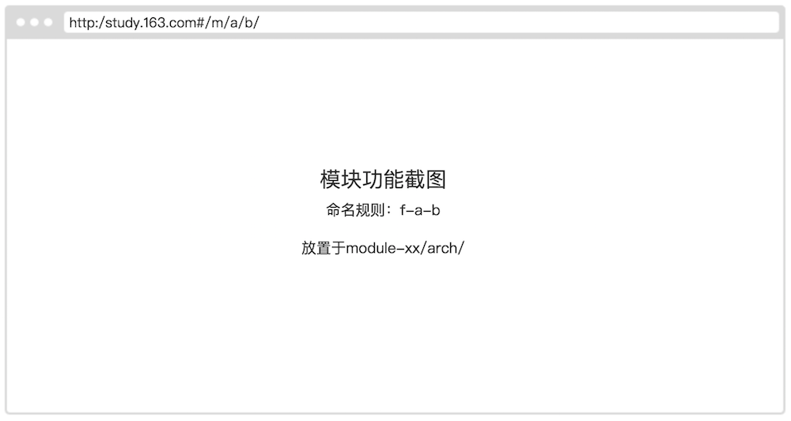

# column 模块

## 模块状态

--------

## 目录
- [模块设计](#模块设计)
- [column-模块](#column-模块)

    - [#/m/column/list/](#1-mcolumnlist)：[时序图设计](./design/list/design.md)

    - [#/m/column/create/](#2-mcolumncreate)：[时序图设计](./design/create/design.md)

    - [#/m/column/manage](#3-mcolumnmanage)：[时序图设计](./design/manage/design.md)

       - [#/m/column/manage/edit/](#31-mcolumnmanageedit)：[时序图设计](./design/manage/edit/design.md)

       - [#/m/column/manage/topbar](#32-mcolumnmanagetopbar)：[时序图设计](./design/manage/topbar/design.md)

          - [#/m/column/manage/topbar/info/](#321-mcolumnmanagetopbarinfo)：[时序图设计](./design/manage/topbar/info/design.md)

          - [#/m/column/manage/topbar/list/](#322-mcolumnmanagetopbarlist)：[时序图设计](./design/manage/topbar/list/design.md)

          - [#/m/column/manage/topbar/draft/](#323-mcolumnmanagetopbardraft)：[时序图设计](./design/manage/topbar/draft/design.md)

    - [#/m/column/admin](#4-mcolumnadmin)：[时序图设计](./design/admin/design.md)

       - [#/m/column/admin/list/](#41-mcolumnadminlist)：[时序图设计](./design/admin/list/design.md)

       - [#/m/column/admin/preview/](#42-mcolumnadminpreview)：[时序图设计](./design/admin/preview/design.md)

       - [#/m/column/admin/unverify](#43-mcolumnadminunverify)：[时序图设计](./design/admin/unverify/design.md)

          - [#/m/column/admin/unverify/column/](#431-mcolumnadminunverifycolumn)：[时序图设计](./design/admin/unverify/column/design.md)

       - [#/m/column/admin/verify](#44-mcolumnadminverify)：[时序图设计](./design/admin/verify/design.md)

          - [#/m/column/admin/verify/column/](#441-mcolumnadminverifycolumn)：[时序图设计](./design/admin/verify/column/design.md)

## 模块设计

---------

## column-模块

## 1 #/m/column/list/
|  字段     |     描述 |
| -------- | -------- |
| 模块UMI  | #/m/column/list/ |
| 模块别名  |  column-list |
| 时序图设计|  :secret: [时序图设计](./design/list/design.md)|
| 模块功能  | |

## 2 #/m/column/create/
|  字段     |     描述 |
| -------- | -------- |
| 模块UMI  | #/m/column/create/ |
| 模块别名  |  column-create |
| 时序图设计|  :secret: [时序图设计](./design/create/design.md)|
| 模块功能  | |

## 3 #/m/column/manage
|  字段     |     描述 |
| -------- | -------- |
| 模块UMI  | #/m/column/manage |
| 模块别名  |  column-manage |
| 时序图设计|  :secret: [时序图设计](./design/manage/design.md)|
| 模块功能  | |

### 3.1 #/m/column/manage/edit/
|  字段     |     描述 |
| -------- | -------- |
| 模块UMI  | #/m/column/manage/edit/ |
| 模块别名  |  column-manage-edit |
| 时序图设计|  :secret: [时序图设计](./design/manage/edit/design.md)|
| 模块功能  | |

### 3.2 #/m/column/manage/topbar
|  字段     |     描述 |
| -------- | -------- |
| 模块UMI  | #/m/column/manage/topbar |
| 模块别名  |  column-manage-topbar |
| 时序图设计|  :secret: [时序图设计](./design/manage/topbar/design.md)|
| 模块功能  | |

#### 3.2.1 #/m/column/manage/topbar/info/
|  字段     |     描述 |
| -------- | -------- |
| 模块UMI  | #/m/column/manage/topbar/info/ |
| 模块别名  |  column-manage-topbar-info |
| 时序图设计|  :secret: [时序图设计](./design/manage/topbar/info/design.md)|
| 模块功能  | |

#### 3.2.2 #/m/column/manage/topbar/list/
|  字段     |     描述 |
| -------- | -------- |
| 模块UMI  | #/m/column/manage/topbar/list/ |
| 模块别名  |  column-manage-topbar-list |
| 时序图设计|  :secret: [时序图设计](./design/manage/topbar/list/design.md)|
| 模块功能  | |

#### 3.2.3 #/m/column/manage/topbar/draft/
|  字段     |     描述 |
| -------- | -------- |
| 模块UMI  | #/m/column/manage/topbar/draft/ |
| 模块别名  |  column-manage-topbar-draft |
| 时序图设计|  :secret: [时序图设计](./design/manage/topbar/draft/design.md)|
| 模块功能  | |

## 4 #/m/column/admin
|  字段     |     描述 |
| -------- | -------- |
| 模块UMI  | #/m/column/admin |
| 模块别名  |  column-admin |
| 时序图设计|  :secret: [时序图设计](./design/admin/design.md)|
| 模块功能  | |

### 4.1 #/m/column/admin/list/
|  字段     |     描述 |
| -------- | -------- |
| 模块UMI  | #/m/column/admin/list/ |
| 模块别名  |  column-admin-list |
| 时序图设计|  :secret: [时序图设计](./design/admin/list/design.md)|
| 模块功能  | |

### 4.2 #/m/column/admin/preview/
|  字段     |     描述 |
| -------- | -------- |
| 模块UMI  | #/m/column/admin/preview/ |
| 模块别名  |  column-admin-preview |
| 时序图设计|  :secret: [时序图设计](./design/admin/preview/design.md)|
| 模块功能  | |

### 4.3 #/m/column/admin/unverify
|  字段     |     描述 |
| -------- | -------- |
| 模块UMI  | #/m/column/admin/unverify |
| 模块别名  |  column-admin-unverify |
| 时序图设计|  :secret: [时序图设计](./design/admin/unverify/design.md)|
| 模块功能  | |

#### 4.3.1 #/m/column/admin/unverify/column/
|  字段     |     描述 |
| -------- | -------- |
| 模块UMI  | #/m/column/admin/unverify/column/ |
| 模块别名  |  column-admin-unverify-column |
| 时序图设计|  :secret: [时序图设计](./design/admin/unverify/column/design.md)|
| 模块功能  | |

### 4.4 #/m/column/admin/verify
|  字段     |     描述 |
| -------- | -------- |
| 模块UMI  | #/m/column/admin/verify |
| 模块别名  |  column-admin-verify |
| 时序图设计|  :secret: [时序图设计](./design/admin/verify/design.md)|
| 模块功能  | |

#### 4.4.1 #/m/column/admin/verify/column/
|  字段     |     描述 |
| -------- | -------- |
| 模块UMI  | #/m/column/admin/verify/column/ |
| 模块别名  |  column-admin-verify-column |
| 时序图设计|  :secret: [时序图设计](./design/admin/verify/column/design.md)|
| 模块功能  | |

